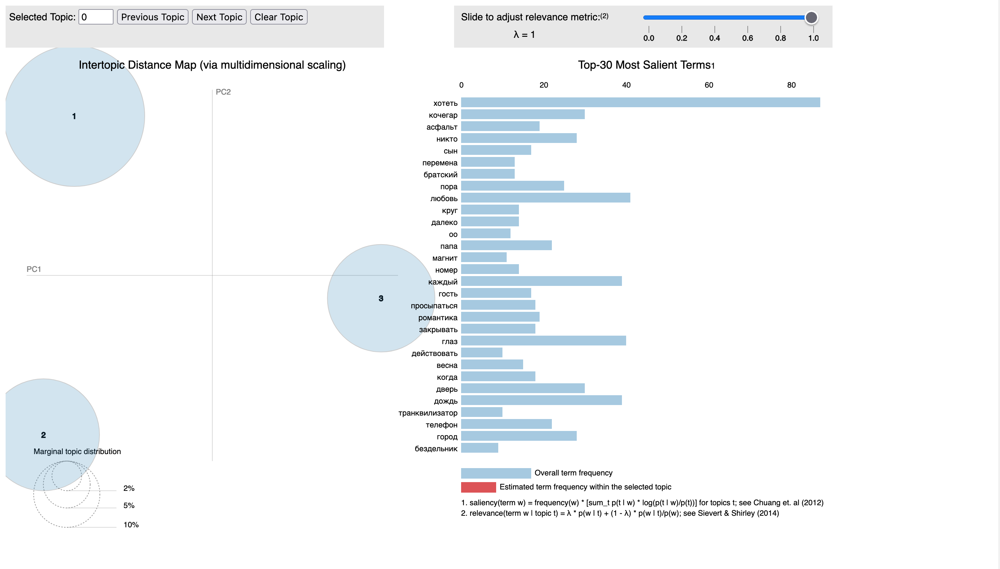
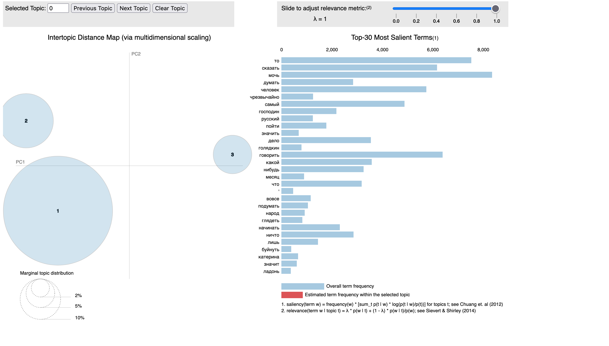
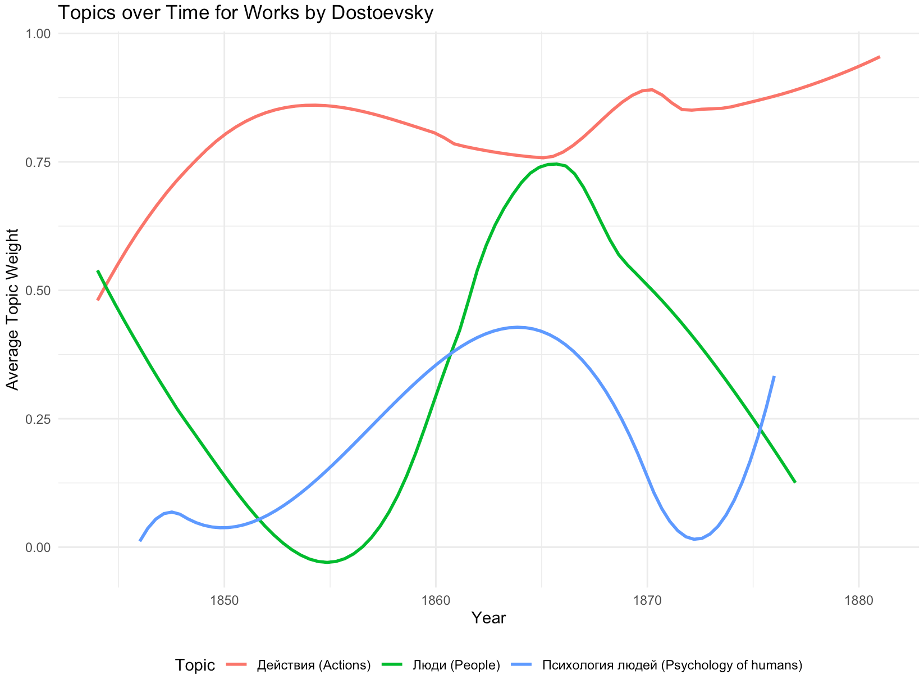
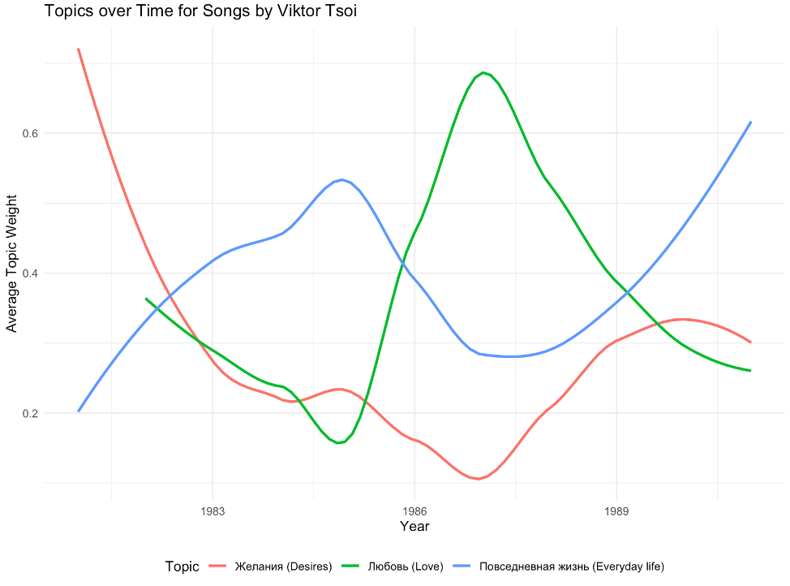

## Background of Project

As of writing this post, I have studied Russian for approximately 9 years. I enjoyed studying Russian enough that I also studied it in college in addition to statistics. Since I enjoy both the Russian language and statistics, I wanted to find a way to combine the two of them together. Natural language processing (NLP) is one way that I am able to combine the two interests where computers and algorithms are used to analyze and attempt to find meaning from human language.

In a linguistics class I took in college, we were briefly introduced to topic modeling. Topic modeling is a form of unsupervised machine learning that takes a large collection of documents and attempts to find relevant topics or clusters. In this class, we were only introduced to the general idea of it, but since I have a statistics background, I spent some time learning about topic modeling. I won't outline much of the statistical details here because there are more than enough resources on the internet already that outline the statistics behind topic modeling.

Since I found the idea and details behind topic modeling interesting, I decided to make that the center of this project. When deciding what kind of text I wanted to analyze, I decided to examine texts from two unique areas: literature and music. I really enjoy Dostoevsky's works of literature with Crime and Punishment being one of my favorite novels of all-time, so I wanted to analyze his works. When deciding what type of music to examine, I eventually decided to collect the lyrics for songs written by Viktor Tsoi, who was one of the more influential musicians in the Soviet Union and his music is still popular among people in Russia.

The final idea for this project was inspired by [this post](https://medium.com/the-die-is-forecast/topic-modeling-as-osint-exploring-russian-presidential-speech-topics-over-time-ad6018286d37), which outlined looking at topics discovered from topic modeling over time and examining which themes were more prevalent over the course of time. I thought this would be interesting to explore, especially because Dostoevsky's writing evolved and changed over time and I was interested if I could discover topics or groups that could show that.

The rest of this post will outline where the data was collected from, how the text was preprocessed for topic modeling, the process of determining the topics, and finally examining the prevalence of these topics over time.

## Data Collection/Web Scraping

I needed data from different sources for this project. I needed to find somewhere where I could get the text for songs by Viktor Tsoi as well as the text from Dostoevsky's published works. I was able to find the data from two different sources.

For Viktor Tsoi's songs, I ended up needing to webscrape the lyrcis for songs from the internet. I found a [website](https://lyric-text.ru/viktor-tsoy/) that contained links to the songs and their lyrics from Viktor Tsoi. I decided to use BeautifulSoup to webscrape, so I ended up copying the URLs for the four pages of songs. The code below outlines the process of getting the links for each song and saving the song title as well.

```{python, eval=FALSE}
# Create empty list for links and song title
links = []
song_title = []
# Loop through the four URLs to scrape from
for url in urls:
    # Specify header information related to your computer
    headers = {
        #header_information for your computer}
    # Make a request to the web page
    response = requests.get(url, headers=headers)
    # Parse the HTML content on the page
    soup = bs(response.content, "html.parser")
    # Find all the div tags with the specific class
    paragraphs = soup.find_all("div", {'class': 'content_box'})
    # Loop through each found div tag
    for paragraph in paragraphs:
        # Pull all the anchors out
        anchors = paragraph.find_all('a')
        # Try to take the href from the anchor tag if possible
        for anchor in anchors:
            try:
                links.append(anchor.attrs['href'])
                song_title.append(anchor.get_text())
            # print that the anchor is skipped if there is a KeyError resulting from no href attribute
            except KeyError:
                print("skipping this anchor because it doesn't have an href attribute")
```

After I extracted the links for each song, I looped through each link and extracted the song lyrics and saved the title and lyrics to a `.txt` file to be used later. In order to get the song lyrics, I only needed to extracted the paragraph element from the main div that contained the content on the page. The code for scraping the lyrics and saving them to a file are provided before:

```{python, eval=FALSE}
with open(f"songs.txt", mode='w') as outfile:
    # Write a header for the file
    outfile.write("Title" + "\t" + " Lyrics" + '\n')
    # Loop through the links
    for i in range(len(links)):
        # Get the HTML content
        response = requests.get(links[i], headers=headers)
        # Parse the HTML content on the page
        soup = bs(response.content, "html.parser")
        # Find all the divs with the specific class and then the paragraph inside
        paragraphs = soup.find('div', {'class': 'content_box'}).find('p')
        # Write out to text file if there is text
        try:
            outfile.write(song_title[i] + "\t" + paragraphs.get_text(strip=True) + '\n')
            print(f'Writing {song_title[i]}')
        except:
            print("No text. Moving to next link")
            continue
```

Finding the texts of Dostoevsky's works was a lot easier than getting the song lyrics I needed. There was a [Kaggle dataset](https://www.kaggle.com/datasets/d0rj3228/russian-literature/data) that had text files for 34 works of literature by Dostoevsky. This didn't include everything that Doestoevsky ever wrote, but it did include his major works, so I thought that it was enough for this project.

The Kaggle dataset also included a file that had the year the book was written, which was also need for determining how the topics changed over time. I had to manually create a file that had the year that each song was written. I used Wikipedia to get the years when songs were written.

Once I had collected all of the data, I was able to begin working with the data. There was a decent amount of preprocessing that needed to be done before I could try topic modeling.

## Text Preprocessing

There were a number of steps that I took to preprocess the text for analyzing and topic modeling. I'll walk through the general preprocessing steps that I took and then I will highlight a few specific details that relate to this specific project.

The general steps that I took to clean up the texts for topic modeling include:

-   Removing any punctuation or white space

-   Removing stopwords

-   Split the text into words

-   Lemmatization of words

I wrote a function that is shown below to perform all of the preprocessing steps.

```{python, eval=FALSE}
russian_stopwords = stopwords.words("russian") + ["твой", "наш", "это", "--", "\"", "–", "—",
                                                  "…", ",", "...", "…", "»", "«", "-", "м", "когда", "э", "24", "то", "припев", "то", "весь", ":", "эй", "кто", "свой"]


# Preprocess function for the text
def preprocess_text(text):
    tokens = mystem.lemmatize(text.lower())
    tokens = [token for token in tokens if token not in russian_stopwords \
              and token != " " \
              and token.strip() not in string.punctuation]

    text = " ".join(tokens).replace(",", " ").replace("«", " ").replace("–", " ").replace("--", " ").replace("—", " ").replace("-", " ").replace("»", " ").replace("\"", " ").replace("::", " ")

    return text

```

One difference with preprocessing is that I was working with Russian texts, which have a different grammatical structure. Russian uses grammatical cases where nouns and adjectives change endings depending on their placement and meaning in a sentence. As a result of this, a single noun can have multiple different endings depending on the sentence, but has more or less the same meaning. Using lemmatization to break down these words to their original base word, instead of just to a stem using stemming, is extremely helpful for getting meaning out of Russian texts. I ended up using `pymystem3`, which uses Yandex's morphological analyzer, MyStem. 

The other nuance with preprocessing is that although NLTK has stopwords for Russian, it only has a small number of potential stopwords. Initially, I looked at the topic using only the Russian stopwords from NLTK, but found a lot of additional words that would be considered stopwords and had minimal meaning when examinig topics. As a result, I manually added additional words to the stopwords that I removed. 

After the text for both the songs and the novels were cleaned, I created a corpora for the songs and books separately. With each corpora, I also calculated the document term matrix to be used for topic modeling with Latent Dirichlet Allocation (LDA). 

## Topic Modeling using LDA

With the corpora and document term matrix, I could fit the model using LDA. The model was fit using `gensim`. One recommended approach to determining the number of topics is to fit many LDA models with different number of topics and then select the model with the highest coherence score. For this project, I just used a process of trial and error. When I increased to anything more than 3 topics, two of the topics would always be overlapping with each other, where as 3 topics seemed to provide a good separation between the topics.

There is good separation between the topics for Dostoevsky's novels which is shown below. I would expect good separation here because Dostoevsky wrote novels over a long period of time and his interests and style changed and evolved throughout his life. 



The separation isn't as good for Viktor Tsoi's songs, but I decided to also have three topics because it seemed like there was always some separation between the two topics that are close together. 



After identifying the topics, I tried to summarize or label these groups/topics. It can be somewhat difficult when looking at the most common terms to find an adequate label. My topics for Dostoevsky were: 

1. Действия (Actions)
2. Люди (People)
3. Психология людей (Psychology of humans)

The topics for Viktor Tsoi were: 

1. Желания (Desires)
2. Любовь (Love)
3. Повседневная жизнь (Everyday life)

These topics are very broad, but it was the best I could do to narrow these topics down to a single label or word. Better or more accurate descriptions could likely be applied if additional thought was given. 

With my topics, I could now calculate how the prevelance of these topics changed throughout time. 

## Topics over Time

The prevalence of topics over time is determined by extracting the weight for each of the three topics for each document in the document term matrix and then calculating the average weight of each topic for each year. 

The weights for each topic can be extracted from the model using the following code where this code is used as you loop through every document you have: 
```{python, eval = FALSE}
# Get the weights for each document
doc_weights = lda_model[doc_term_matrix[i]]
# Add the weights into the data frame
weights_df = pd.DataFrame(doc_weights, columns = ['topic', 'prob_weight'])
```

After getting the weights for each document, I merged the weights back into my dataset with the names of the original novels and songs as well as the year they were published. For each of the books and songs datasets, I then calculated the average weight of each topic for each year. Since there wasn't a novel or song for every single year, I applied some smoothing to the curves to get a better idea of general trends. 

Not surprisingly, the most prevalent topic over time for Dostoevsky was the actions topic. Often novels are describing things that are happening and have some sort of movement and actions. Interestingly, the weight for psychology of humans increases around the time when Dostoevsky published Crime and Punishment, which is a novel that spends a lot of time examining the psychology of the main character (I won't explain more than that, so as to not spoil what the novel is about if you haven't read it).



The topics have more fluctuate from Viktor Tsoi's songs, which I would expect. There is likely more variation and evolution in the topics of songs in comparison to the style of an author. Songs can still have a similar style, but change the topics they are about. Earlier songs seem weighted towards everyday life topics, which seems logicial given they were written in the Soviet Union in the early 80s. As the decade progressed and as there was somewhat more flexibility within the Soviet Union, Tsoi moved towards other topics such as love and desires. It would have been interesting to see how these topics continue to evolve further, but Tsoi tragically died in a car accident in 1990. 



## Recap

In short, I really enjoyed working on this project because it gave me a chance to combine the two things (statistics and Russian) that I studied in college. I was able to obtain the data from Kaggle as well as through web scraping. Preprocessing was done to prepare the text for modeling, while special attention was given to certain steps since I was working with Russian, which has different grammatical rules and patterns than English. 

The results of this project gave three different topics from the works of literature of Dostoevsky and three topics from the song lyrics of Viktor Tsoi and examined the prevalence of those topics over time. It provided a brief overview of how these topics were obtained. 

I think it would be interesting to put more time into selecting topics or using the highest coherence score to determine the number of topics, while also being able to better label the topics. I also think it would be interesting to pull other types of text (social media posts, news articles, etc.) and see how topics from those medium change over time. 
